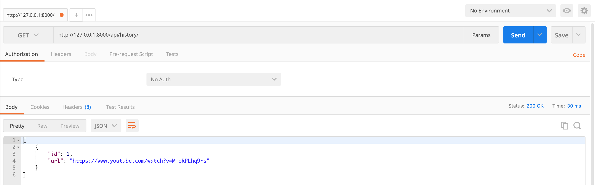
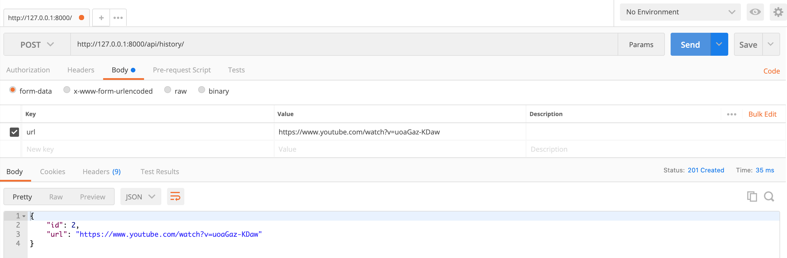

# Video-Player API

This application provides 2 routes to: 

* List current history
* Save an URL into the history table

This application is testable with an API tester like [Postman](https://www.getpostman.com).


* The project is organized with two main apps:

  * **core:** manages the migrations, models and their tests for all project;
  * **history:** manages the logic for history records with urls, serializers, views and API tests.

## How to run the API in my machine

Please make sure that you have:
* **Python**
* **Pip**
* A dependency manager, such **pipenv**

To use a new shell that ensures all commands have access to installed packages use

```bash
$ pipenv shell
```

Then, run the following commands. The project is inside `video-player/backend`

### Requirements

The existing dependencies in this API:

* Django >= `3.0.8`, but less than `3.1.0`
* Django Rest Framework >= `3.11.0`, but less than `3.12.0`
* Flake8 >= `3.8.3`, but less than `3.9.0`
* Factory-boy >= `2.12.0`, but less than `2.13.0`

```bash
# to run requirements
$ pip install -r requirements.txt
```

### Run migrations

```bash
# to create the migrations according the existing models
$ python manage.py makemigrations
# to trigger the migrations
$ python manage.py migrate
```

### Run server

```bash
$ python manage.py runserver
```

**One note:** the URL must have one of the following substrings:
* `youtube.com/watch?`
* `youtu.be`

### To access History API

Open your favorite browser and write

`http://127.0.0.1:8000/api/history/`

## Test

```bash
# to run tests
$ python manage.py test **/*/.
```

### Test with Postman

* Open [Postman App](https://www.postman.com/)

**GET**
* check if the verb is **GET**
* Enter the previous address in address bar
* If you have some URLs already persisted, they will be returned


**POST**
* check if the verb is **POST**
* Enter the previous address in address bar
* Select **Body** and set a key-value pair: *key* must be **url** and the *value* the YouTube Video URL.
* It returns the new url and you can check it when you try to use **GET**
