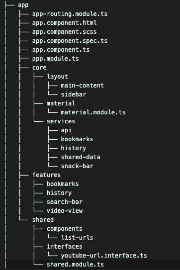
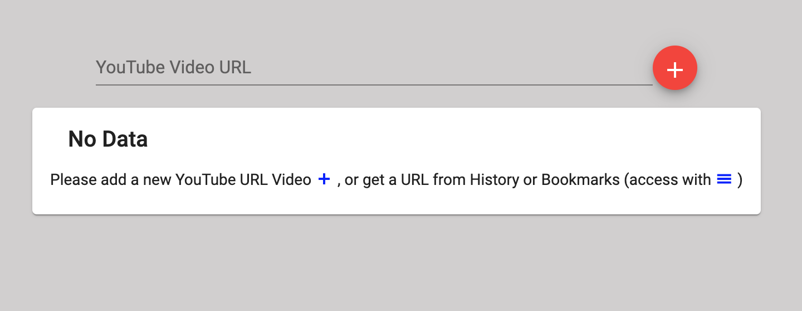
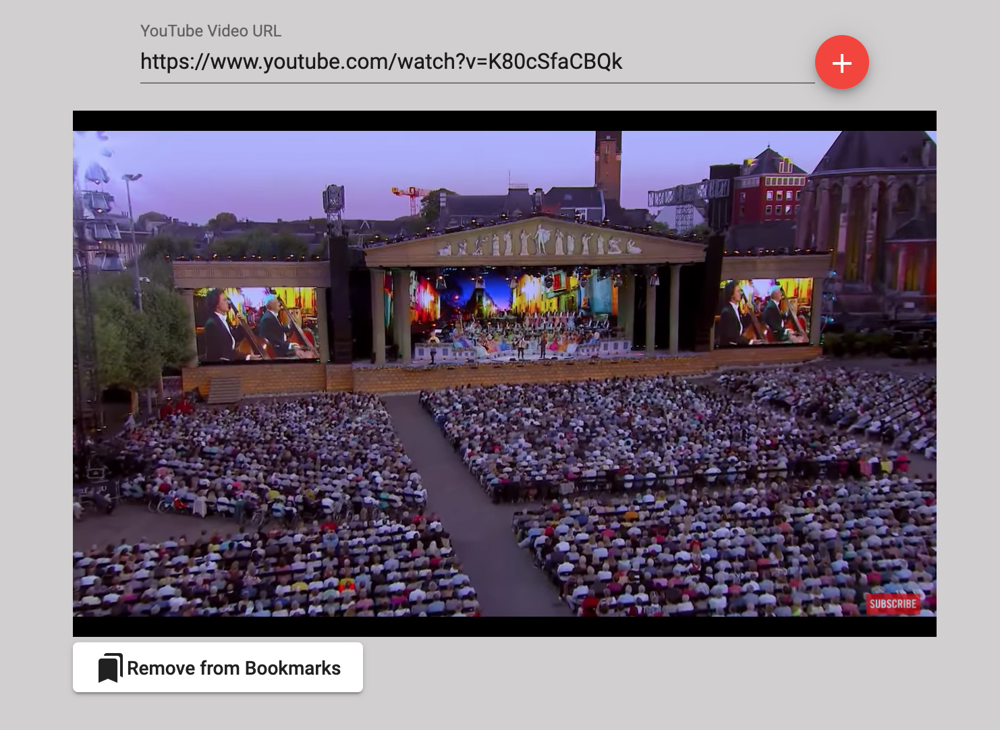
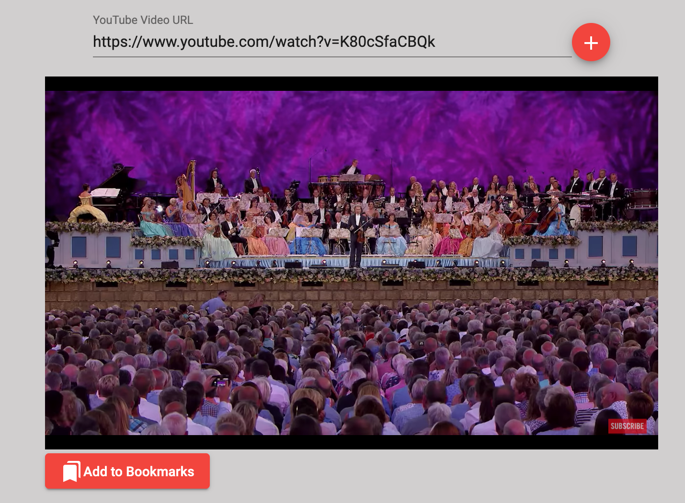
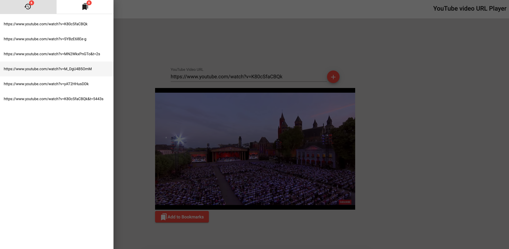
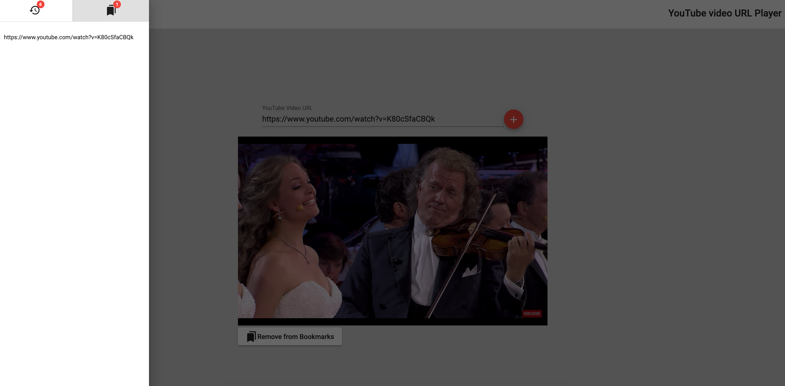

# Front-End | VideoPlayerApp

**Make sure that you are inside `frontend/video-player-app` folder to proceed with the following information.**

This project was generated with [Angular CLI](https://github.com/angular/angular-cli) version **10.0.3**.

It uses _localStorage_ for bookmarks and history and the _Django API_ to list and create entries for History. When the app starts, tries to load data from the API for History.

## Development server

First time?

* `npm install` 

Then, run:

* `ng serve`
* `npm start`

for a dev server. Navigate to `http://localhost:4200/`. The app will automatically reload if you change any of the source files.

* If you want to change the API path, please update `environment/` files.

## Build

Run `ng build` to build the project. The build artifacts will be stored in the `dist/` directory. Use the `--prod` flag for a production build: `ng build --prod`.

## Components

Besides the `AppComponent`, which is the "_front door_" to separate the **Sidebar** and **MainContent** components.

### Layout

* `MainContent:` it is where we can see the topbar, the input and video boxes.
* `SideBar:` is called with a 'Menu' button (top left of the page). There, it exists a set of button toggles to access **history** (default) and **bookmarks**.
### Features

There are 4 components related to features:
* `SearchBar:` with an input box and a button to allow to the user to give the YouTube video URLs
* `VideoView:` the component where the video happens. It uses the Angular's `YouTubePlayerModule` to help to render the video. It displays a message when no YouTube video URLs are setted to play. By the way, it is not auto-play.
* `History:` this component is inside a Angular Material's `MatSideNav` and uses the shared component `ListUrls` to list the YouTube video URLs persisted in History.
* `Bookmarks:` same way as **History** component.

All these components have a corresponding `.module.ts` in order to be more easier for sake of modularity.

### Shared

* `ListUrls:` the ideia is to be reusable by `History` and `Bookmarks`.

### Communication between components
* **For compone`ts with relationship like parant and child:** it is with `@Input()` and `@Output()`.
* **For components without a direct relationship:** it is used the `SharedData service` with a `BehaviourSubject` URL that is shared among the components (`Sidabar` and `MainContent` components).

## Services

* `Api:` allows to prepare the _get_ and _post_ to communicate about `History` (for now).
* `Bookmarks:` manages the _localStorage_ for **Bookmarks** logic.
* `History:` allows to communicate with API and manage the _localStorage_ for **History** logic.
* `SharedData:` us`d to share data among components without direct relationship, sharing a URL in a _BehaviourSubject_.
* `SnackBar:` uses a Angular Material capabily to display some notification.

## Dependencies

* **Angular Material:** MatIconModule, MatButtonModule, MatButtonToggleModule MatToolbarModule, MatSidenavModule, MatFormFieldModule, MatInputModule, MatCardModule, MatListModule, MatBadgeModule, MatSnackBarModule
* **Angular YouTubePlayerModule:** to display the video.

## Folder disposition

## Prints

* No videos to show

* Bookmarked video (white button in the bottom of the video)

* Not bookmarked video (orange button in the bottom of the video)

* History (including badges with the number of videos in History)

* Bookmarks (including badges with the number of videos in Bookmarks)

